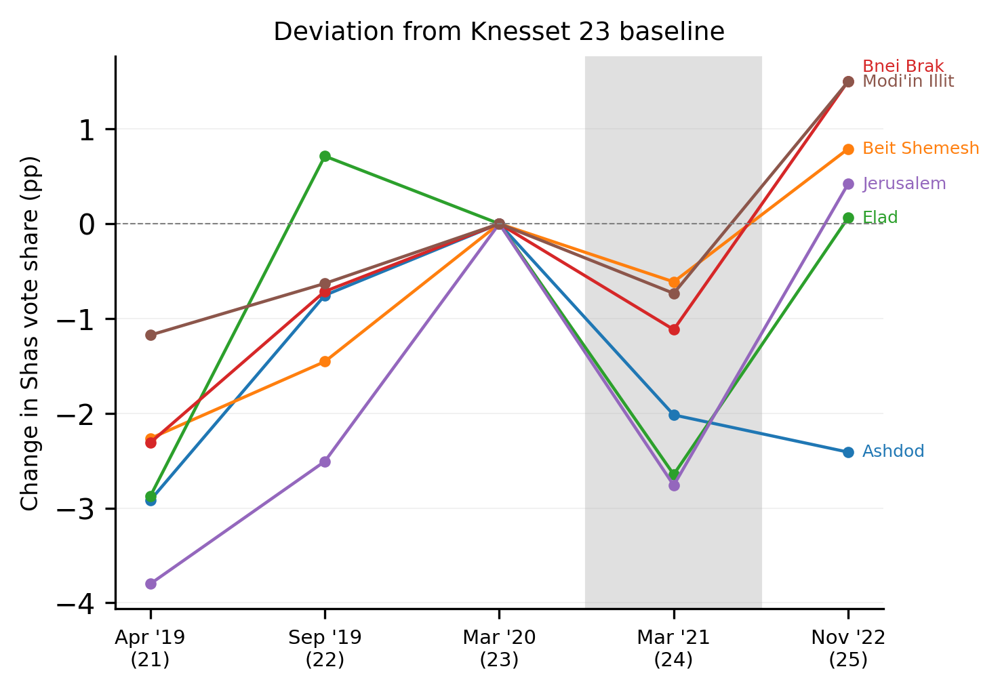

# Results

The analysis confirms high baseline loyalty within both Shas and UTJ, yet reveals significant temporal and geographic
variation in voter transitions. Most strikingly, a dramatic but temporary disruption in the March 2020–March 2021
transition (Knesset 23→24) affected all major Haredi cities, followed by complete recovery.
Model diagnostics confirming adequate fit are provided in Appendix B.

Table 1 presents the election dates and inter-election intervals for all Knesset elections covered in this study.

**Table 1: Election Dates and Intervals**

| Knesset | Election Date | Months Since Previous |
|---------|---------------|-----------------------|
| 18 | February 10, 2009 | — |
| 19 | January 22, 2013 | 47.4 |
| 20 | March 17, 2015 | 25.8 |
| 21 | April 9, 2019 | 48.8 |
| 22 | September 17, 2019 | 5.3 |
| 23 | March 2, 2020 | 5.5 |
| 24 | March 23, 2021 | 12.7 |
| 25 | November 1, 2022 | 19.3 |

## Country-Level Transitions

At the national level, the transition matrices reveal strong voter loyalty within both Haredi parties. Shas retained on
average more than 90% of its voters across elections, while UTJ consistently preserved above 95%. However, the magnitude
of "within-bloc permeability" — voters shifting between Shas and UTJ — varied notably over time.

The March 2020–March 2021 transition (Knesset 23→24) showed an unusual and dramatic decline in intra-Haredi loyalty,
particularly among Shas voters. At the country level (Figure 2), Shas-to-Shas loyalty plummeted from 98.9% (in the
September 2019–March 2020 transition, Knesset 22→23) to just 73.5% in the 23→24 transition. Simultaneously, the
probability of Shas voters switching to UTJ jumped from near zero to 12.3%. UTJ voters also experienced reduced
loyalty, dropping from 96.6% to 87.9%, with 4.6% of UTJ voters defecting to Shas. The estimated decline in party
retention corresponds to roughly one parliamentary seat per party, illustrating the political significance of even modest
swings in Haredi voting patterns. The temporary drop thus had a tangible potential to alter coalition outcomes, yet it was masked in
aggregate results by offsetting trends among non-Haredi voters. This cross-flow pattern represents an unprecedented disruption in the typically stable Haredi voting bloc. Critically, this
disruption was observed across multiple geographic scales: both at the national level (Figure 2) and across individual
cities (Figure 4), indicating a system-wide rather than localized phenomenon. Notably, this disruption was temporary: in
the subsequent March 2021–November 2022 transition (Knesset 24→25), loyalty rates recovered substantially (Shas: 96.9%,
UTJ: 95.5%).

**Important clarification:** All transition estimates reported here are based exclusively on Haredi-filtered ballot
boxes (≥75% Shas+UTJ). This recovery in retention probabilities does not indicate that individual voters who had
"strayed" from Shas returned to the party. Rather, it reflects that the "leak" of voters from Shas to other parties
stopped (see Methods section on the distinction between voting behavior probabilities and individual voter movements).
The actual voter movements are captured by the off-diagonal elements of the transition matrix, the flows between
parties, not by the diagonal retention rates themselves. Critically, none of the off-diagonal transitions into Shas
(UTJ→Shas, Other→Shas, Abstain→Shas) showed unusual spikes in the March 2021–November 2022 transition (Knesset 24→25),
confirming that voters who left Shas in the 23→24 disruption did not return.

Paradoxically, despite losing core Haredi voters in 23→24 without recovering them in 24→25, Shas's national vote share
increased from 7.17% to 8.25% (9 to 11 seats). Since Haredi population hubs show no corresponding Shas influx, this
growth originated from voters outside major Haredi centers. This illustrates how aggregate vote-share growth can mask
internal dynamics: Shas simultaneously lost votes in its core ultra-Orthodox base (to UTJ in 23→24) while gaining peripheral
traditional Sephardic supporters.

As Table 1 shows, the short inter-election intervals during this period make it very unlikely that the observed
transitions reflect demographic change through migration or generational replacement rather than genuine voter switching.

Figure 2 shows that Haredi abstention rates remained low and stable, contrasting with fluctuating non-Haredi
participation. Cross-over voting between Haredi and non-Haredi parties remained marginal, indicating persistent political
segmentation despite broader electoral turbulence.

*Figure 2: Shas voter loyalty collapsed in the 23→24 transition and recovered by 24→25, while UTJ retention remained comparatively stable. Country-level transition matrices across all election pairs show that the March 2020–March 2021 disruption was exceptional in both magnitude and brevity. Haredi abstention rates stayed low throughout, and cross-over voting between Haredi and non-Haredi parties remained marginal.*

## Raw Vote Shares Across Haredi Hubs

Before examining city-level model estimates, it is useful to inspect the raw data. Figure 3 plots the
election-over-election change in Shas vote share (in percentage points) for each city, computed directly from
Haredi-filtered polling stations (those where Shas + UTJ exceed 75% of legal votes) and requiring no modeling
assumptions. The 23→24 transition is the only one in which Shas's vote share declined in every city simultaneously;
in all other transitions, some cities showed gains while others showed losses.
The magnitude of the dip is modest (1–3 percentage points) because raw vote shares compress the underlying signal — a
voter switching from Shas to UTJ depresses Shas's share while boosting UTJ's, partially canceling in the aggregate. The
ecological inference model (below) disentangles these cross-flows and reveals a much larger disruption in loyalty
probabilities. But the raw data already establish, without any model, that something happened simultaneously across
geographically dispersed cities during the March 2020–March 2021 period. For evidence that these patterns are robust
to model specification, see Appendix C.

*Figure 3: The 23→24 transition is the only period in which Shas vote share declined simultaneously in every city, consistent with a system-wide rather than local shock. Election-over-election change in Shas vote share (percentage points) in Haredi-filtered polling stations. Each line represents one city; the gray band marks the 23→24 transition (March 2020–March 2021).*

## City-Level Variation

City-level analysis reveals substantial variation in the magnitude
of the March 2020–March 2021 (23→24) loyalty disruption across Haredi strongholds. Figure 4 shows that the
disruption was universal, every city experienced reduced Shas loyalty in the 23→24 transition, but the magnitude varied
substantially. Ashdod (blue line) shows the steepest drop to approximately 65%, while other cities cluster between
70–78%. The recovery in the March 2021–November 2022 transition (24→25) was equally universal and nearly complete, with
all cities returning to loyalty rates above 95%.

*Figure 4: All cities experienced a synchronized Shas loyalty collapse in the 23→24 transition and near-complete recovery by 24→25, indicating coordinated disruption rather than independent local dynamics. Shas-to-Shas transition probabilities across cities and election pairs. Ashdod (blue) exhibited the most extreme deviation, dropping to approximately 65%.*

**Ashdod** exhibited the most dramatic deviation from national patterns. Notably, Ashdod already showed early signs of
instability before the system-wide shock: Shas loyalty declined from 91.8% in the 21→22 transition to 83.6% in
22→23. In the 23→24 disruption itself, as shown in Figure 5, Shas-to-Shas loyalty dropped to just 67.1% (compared to
73.5% nationally), while the Shas-to-UTJ switching rate surged to 19.3%, more than 50% higher than the national rate
of 12.3%. In the subsequent 24→25 transition, Ashdod's Shas loyalty recovered to 96.9%, closely tracking the national
pattern.

*Figure 5: Ashdod's Shas-to-UTJ switching reached 19.3% in the 23→24 transition, more than 50% above the national rate, making it the most extreme case of cross-ethnic voter movement. Full transition matrices for Ashdod across all election pairs.*

Other major Haredi cities showed similar but more moderate disruptions. Beit Shemesh experienced a Shas loyalty drop to
75.2% (with 9.5% switching to UTJ), while Bnei Brak, despite being a predominantly Ashkenazi stronghold, saw Shas loyalty
fall to 70.9% (with 15.8% switching to UTJ). Both cities fully recovered by the 24→25 transition. Detailed transition
matrices for these cities are provided in Appendix A.

The consistency of this temporal pattern across cities, sharp disruption followed by full recovery, is consistent with
a system-wide rather than city-specific phenomenon. The variation in magnitude and the destination of the switched votes correlate with demographic composition:
cities with more integrated Sephardic-Ashkenazi populations (Ashdod, Bnei Brak) showed larger cross-flows than more
homogeneous communities. Both parties maintained their coalition positions despite the internal reshuffling.

A key concern is whether the hierarchical model structure mechanically produces the observed inter-city synchronization.
To test this, I fitted two alternative specifications: a relaxed hierarchical model allowing substantially greater
city-specific deviations (+166% variability) and a fully independent model with no hierarchical pooling (+248%
variability). Despite cities diverging more from national patterns under both alternatives, the synchronized drops and
recoveries in Shas loyalty persisted across all specifications (see Appendix C for full details and figures).

Taken together, the transition matrices reveal a pattern of high baseline stability punctuated by a sharp
disruption in the 23→24 transition that fully reversed by 24→25 (smaller episodic deviations occurred in other
transitions — notably a Shas loyalty drop to 85.0% with 13.8% defecting to non-Haredi parties in the 19→20
transition — but none approached the 23→24 magnitude or geographic synchronization). The disruption affected all major Haredi population
centers but varied in magnitude, with Ashdod showing the most extreme deviations. The short intervals between elections
make demographic explanations implausible, pointing instead to genuine voter switching. The Conclusions section
interprets these patterns within the "rigidity with stress fractures" framework and explores their theoretical and
methodological implications.
