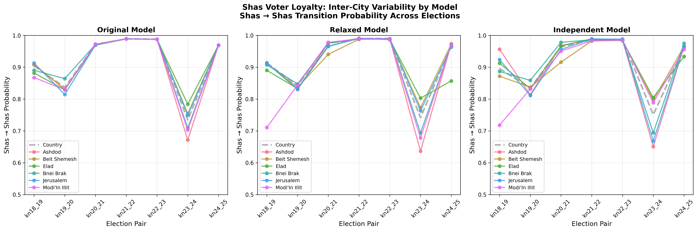

# Appendix

## Appendix A  City-Level Transition Matrices

The following figures provide detailed transition matrices for all analyzed cities across consecutive elections.  These
supplement the summary analysis presented in the main text, particularly the condensed discussion in the City-Level
Variation section.

### Ashdod

*Figure A1: Ashdod exhibited the most extreme disruption during the March 2020–March 2021 transition (2324), with Shas loyalty
dropping to 67.1% and 19.3% switching to UTJ.*

### Beit Shemesh

*Figure A2: Beit Shemesh showed moderate disruption with Shas loyalty falling to 75.4% during the 2324 transition.*

### Elad

*Figure A3: Elad transition patterns across all election pairs.*

### Bnei Brak

*Figure A4: Bnei Brak, despite being predominantly Ashkenazi, experienced a sharp Shas loyalty drop to 70.9% during the 2324
transition.*

### Jerusalem

*Figure A5: Jerusalem transition patterns across all election pairs.*

### Modi'in Illit

*Figure A6: Modi'in Illit transition patterns across all election pairs.*

## Appendix B  Model Validation and Diagnostics

This section documents model validation through posterior predictive checks and convergence diagnostics for transparency
and reproducibility.

### Model Validation

Posterior predictive checks confirm that the model adequately reproduces empirical vote counts across all elections.
Most chains converged successfully, with effective sample sizes (ESS) exceeding 400 for key parameters and R-hat values
approaching 1.01 in later runs. Minor convergence issues in earlier election pairs (January 2013March 2015 transition,
Knesset 1920) were resolved by increasing the number of draws and adopting non-centered parameterization.

### Convergence Diagnostics

| Transition | R-hat max | ESS min | |------|------------|----------| | Kn 1920 (Jan 2013Mar 2015) | 1.530 | 7 | | Kn
2021 (Mar 2015Apr 2019) | 1.529 | 7 | | Kn 2122 (Apr 2019Sep 2019) | 1.465 | 7 | | Kn 2223 (Sep 2019Mar 2020) | 1.134 |
19 | | Kn 2324 (Mar 2020Mar 2021) | 1.477 | 7 | | Kn 2425 (Mar 2021Nov 2022) | 1.737 | 6 |

While some early models show high R-hat and low ESS, these issues were largely addressed through increased sampling and
refined priors. The final models show stable posteriors without divergences.

Representative diagnostics are shown below.

*Figure B1: Rank plots for the Kn 2122 (April 2019–September 2019) transition showing uniform distributions across chains, indicating good mixing.*

*Figure B2: Energy plots showing no evidence of divergent transitions or geometric pathologies in the posterior.*

*Figure B3: Autocorrelation plots demonstrating rapid decorrelation of MCMC samples for key model parameters.*

## Appendix C  Model Robustness Testing

To verify that the observed synchronization of voter transitions across cities represents genuine coordinated behavior
rather than an artifact of the hierarchical Bayesian model structure, I tested three alternative model specifications
with varying levels of flexibility for city-specific patterns.

### Model Specifications

**Original Hierarchical Model** (baseline): The model described in the Methods section uses hierarchical pooling with
moderately tight priors to stabilize estimates while allowing cities to deviate from national patterns. Key parameters:
`sigma_D = 0.3`, `delta_scale = 0.5`, `D_sigma = 0.3`.

**Relaxed Hierarchical Model**: Same hierarchical structure but with substantially increased variability parameters to
allow greater city-specific deviations: `sigma_D = 0.8` (+167%), `delta_scale = 1.5` (+200%), `D_sigma = 0.8` (+167%).
This specification tests whether tighter priors artificially constrain city-level patterns.

**Independent Model**: Each city is fitted separately without hierarchical pooling. The country-level transition matrix
is estimated first, then used as a prior mean for independent city-level fits with `sigma_city = 0.8`. This
specification completely removes structural constraints toward similarity between cities.

### Results

Despite the increased flexibility allowing cities to diverge substantially from national patterns (248% increase in
inter-city variability for the independent model), the synchronized drops and recoveries in Shas loyalty remained
evident across all model specifications. Figure C1 shows Shas→Shas retention rates across all three models, revealing
that the temporal patterns and cross-city synchronization persist regardless of model structure.

*Figure C1: Shas→Shas retention rates across models. Each panel shows one location (country or city) with three lines
representing the original hierarchical (blue), relaxed hierarchical (orange), and independent (green) models. The
synchronized drop during the 23→24 transition appears in all models across all cities.*

Figure C2 presents an alternative view with one panel per model, showing all cities together within each specification.
The inter-city standard deviation (shown in gray shading) increases substantially in the relaxed and independent models,
confirming that these specifications successfully allow greater divergence. Yet the temporal correlation across cities
remains evident in all three panels.

*Figure C2: Shas→Shas retention rates by model specification. Each panel shows all cities within one model. Country
estimates shown as thick gray dashed line; individual cities as colored solid lines. Gray shading indicates inter-city
standard deviation. Despite increased flexibility in relaxed and independent models, synchronized patterns persist.*

### Quantitative Comparison

Mean Absolute Deviation (MAD) from country estimates across all transition pairs and electoral categories:

- Original hierarchical: MAD = 0.0044
- Relaxed hierarchical: MAD = 0.0116 (+166%)
- Independent: MAD = 0.0152 (+248%)

The substantial increases in inter-city variability confirm that the alternative specifications successfully relax
constraints. The persistence of synchronized transitions across all specifications demonstrates that the observed
coordination reflects genuine features of the electoral data rather than modeling artifacts.

Full implementation details, including model code and configuration files, are available in the GitHub repository.

## Appendix D — Corpus Evidence for the 23-24 Disruption

This appendix provides the full citations supporting the claims made in the "What Caused the 23-24 Disruption?" section
of the Conclusions. Each citation includes the source outlet, article identifier, publication date, original URL, a
verbatim Hebrew excerpt, and an English translation. The corpus comprises approximately 58,000 items scraped from
Behadrey Haredim (bhol.co.il) and Kikar HaShabbat (kikar.co.il), covering March 2020 to March 2021. All URLs were
accessed and archived between February 18 and March 1, 2026.

### Cross-Ethnic Voter Recruitment Campaign

**D1. Rabbi Mazuz instructed followers to vote UTJ on election morning, Knesset 23 (March 2020).**
> Source: Kikar HaShabbat | ID: kikar-349463 | Date: 2020-03-01 | URL: https://www.kikar.co.il/haredim-news/349463
> Quote: "אחרי שמועות רבות, וקרב ממושך על קולותיהם של אנשי 'כסא רחמים', הגאון רבי מאיר מאזוז הורה הבוקר (ראשון) להצביע ל'יהדות התורה'."
> [After many rumors and a prolonged battle over the votes of the Kisse Rahamim community, Rabbi Meir Mazuz instructed this morning (Sunday) to vote for United Torah Judaism.]

**D2. UTJ operatives engineered the Mazuz endorsement; Shas accused UTJ of "Ashkenazi interference."**
> Source: Kikar HaShabbat | ID: kikar-349484 | Date: 2020-03-01 | URL: https://www.kikar.co.il/haredim-news/349484
> Quote: "בתנועת ש"ס זועמים על ההתערבות האשכנזית המתמשכת בתוך הציבור הספרדי... הרב מאזוז הורה כי לכתחילה יש להצביע ל'יהדות התורה'."
> [In the Shas movement they are furious about the ongoing Ashkenazi interference in the Sephardi public... Rabbi Mazuz ruled that ideally one should vote for United Torah Judaism.]

**D3. Rabbi Yitzhak Barda also instructed to vote UTJ in Knesset 23.**
> Source: Kikar HaShabbat | ID: kikar-349484 | Date: 2020-03-01 | URL: https://www.kikar.co.il/haredim-news/349484
> Quote: "אשר וקרליץ אף רקמו את תמיכת הגאון רבי יצחק ברדא מאשקלון ביהדות התורה."
> [Asher and Karlitz also arranged the support of Rabbi Yitzhak Barda of Ashkelon for United Torah Judaism.]

**D4. Gafni publicly thanked Mazuz after the Knesset 23 results.**
> Source: Kikar HaShabbat | ID: kikar-349726 | Date: 2020-03-02 | URL: https://www.kikar.co.il/haredim-news/349726
> Quote: "בנאומו, הודה גפני לרב מאזוז והרב הכהן."
> [In his speech, Gafni thanked Rabbi Mazuz and Rabbi HaCohen.]

**D5. For Knesset 24, Mazuz split his endorsement — Haredi parties for Torah students, Smotrich for others.**
> Source: Behadrey Haredim | ID: bhol-article-1198514 | Date: 2021-03-20 | URL: https://www.bhol.co.il/news/1198514
> Quote: "בניגוד לסבבים הקודמים בהם העניק הגר"מ מאזוז תמיכה בלעדית למפלגת 'יהדות התורה', בשיעורו השבועי הערב, הכריע הגר"מ לפצל את חלוקת הקולות ל-2 מפלגות."
> [Unlike previous rounds in which Rabbi Mazuz gave exclusive support to United Torah Judaism, in his weekly lecture this evening he decided to split the vote between two parties.]

> Source: Kikar HaShabbat | ID: kikar-387953 | Date: 2021-03-20 | URL: https://www.kikar.co.il/haredim-news/387953
> Quote: "בני התורה צריכים להצביע אך ורק למפלגה חרדית, אבל אלו שהם לא בני תורה, כאלו שחושבים להצביע למפלגות אחרות, שיצביעו עבור סמוטריץ' ובן גביר."
> [Torah students must vote exclusively for a Haredi party, but those who are not Torah students, those thinking of voting for other parties, should vote for Smotrich and Ben Gvir.]

**D6. Rabbi Barda instructed to vote Smotrich in Knesset 24.**
> Source: Behadrey Haredim | ID: bhol-article-1199123 | Date: 2021-03-22 | URL: https://www.bhol.co.il/news/1199123
> Quote: "אחרי בדיקה מעמיקה, ראיתי לנכון להודיע שהמצווה היא להצביע ט׳ של בצלאל סמוטריץ׳."
> [After thorough examination, I saw fit to announce that the religious obligation is to vote Tet (ballot letter) for Bezalel Smotrich.]

**D7. Ashkenazi yeshiva head instructed Sephardi students to vote UTJ, Knesset 24.**
> Source: Kikar HaShabbat | ID: kikar-388061 | Date: 2021-03-22 | URL: https://www.kikar.co.il/yeshiva-world/388061
> Quote: "לא משנה מאיזה עדה - חובה להצביע ליהדות התורה... זו חובה של כל מי שבשם 'בן תורה' ייקרא."
> [It doesn't matter which ethnic community you belong to — it is an obligation to vote for United Torah Judaism... This is the duty of everyone who bears the name "Torah scholar."]

### Inter-Party Friction

**D8. Gafni launched a campaign to recruit Sephardi voters from Shas.**
> Source: Behadrey Haredim | ID: bhol-article-1194886 | Date: 2021-03-10 | URL: https://www.bhol.co.il/news/1194886
> Quote: "פחות משבועיים לפני הבחירות ובדגל התורה החליטו לגייס את תמיכתם של בני התורה הספרדים, אלו שילדיהם לומדים במוסדות אשכנזים. בש"ס זועמים אך שותקים."
> [Less than two weeks before the elections, Degel HaTorah decided to recruit the support of Sephardi Torah scholars, those whose children study in Ashkenazi institutions. In Shas they are furious but silent.]

**D9. Deri attacked Gafni for telling Sephardim to disregard Hakham Shalom Cohen.**
> Source: Kikar HaShabbat | ID: kikar-387209 | Date: 2021-03-10 | URL: https://www.kikar.co.il/haredim-news/387209
> Quote: "יבוא משה גפני עם כל הכבוד, והוא ידידי, ויגיד אל תשמעו לחכם שלום כהן, מה שחכם כהן אומר לכם, דעת תורה ברורה צרופה... אל תשמעו לו. למה?"
> [Moshe Gafni will come, with all due respect — and he is my friend — and say: don't listen to Hakham Shalom Cohen, what Hakham Cohen tells you, a clear and pure Torah ruling... don't listen to him. Why?]

**D10. Gafni called Shas a "racist party."**
> Source: Kikar HaShabbat | ID: kikar-387269 | Date: 2021-03-10 | URL: https://www.kikar.co.il/bchirot-2021/387269
> Quote: "אין שם אף אחד שהוא אשכנזי, הכל שם ספרדים. הוא הולך עם השונאים שלנו ואומר 'החרדים יותר גזענים'. חצוף שכמוהו."
> [There isn't a single Ashkenazi there, they're all Sephardim. He goes to our enemies and says "the Haredim are more racist." What chutzpah.]

**D11. Shas MKs counterattacked, noting UTJ's own voter losses to Smotrich.**
> Source: Kikar HaShabbat | ID: kikar-387269 | Date: 2021-03-10 | URL: https://www.kikar.co.il/bchirot-2021/387269
> Quote: "חבל שבמקום להתרכז בהגדלת הכח של המפלגות החרדיות ולנסות להחזיר קולות של מצביעי 'יהדות התורה' שנטשו לטובת סמוטריץ'... בוחר ח"כ גפני לשלוח רפש ב'ש"ס'."
> [It's a shame that instead of focusing on strengthening the Haredi parties and trying to recover United Torah Judaism voters who defected to Smotrich... MK Gafni chooses to sling mud at Shas.]

**D12. Hakham Shalom Cohen broke down crying, pleading Sephardim to remain loyal to Shas.**
> Source: Behadrey Haredim | ID: bhol-article-1197676 | Date: 2021-03-17 | URL: https://www.bhol.co.il/news/1197676
> Quote: "אנחנו הספרדים יש לנו הכרת טובה רק לתנועת ש"ס. לא משנה איפה אנחנו לומדים - כל ספרדי חייב בהוראה ברורה להצביע רק לש"ס."
> [We Sephardim owe gratitude only to the Shas movement. It doesn't matter where we study — every Sephardi is obligated by a clear directive to vote only for Shas.]

### COVID-19 as Enabling Factor

**D13. Litzman resigned from the government over the holiday lockdown.**
> Source: Behadrey Haredim | ID: bhol-article-1137568 | Date: 2020-09-13 | URL: https://www.bhol.co.il/news/1137568
> Quote: "מאיומים למעשים: השר יעקב ליצמן הודיע כי הוא מתפטר מהממשלה, בעקבות ההחלטה להטיל סגר בר"ה."
> [From threats to action: Minister Yaakov Litzman announced he is resigning from the government following the decision to impose a lockdown on Rosh Hashanah.]

**D14. Kikar HaShabbat survey: 31.7% of Haredi voters said COVID would affect their vote.**
> Source: Kikar HaShabbat | ID: kikar-386120 | Date: 2021-02-23 | URL: https://www.kikar.co.il/haredim-news/386120
> Quote: "60.02% מהנשאלים השיבו כי משבר הקורונה לא ישפיע על ההצבעה... 31.7% מהנשאלים השיבו כי הקורונה כן תשפיע."
> [60.02% of respondents said the COVID crisis would not affect their vote... 31.7% of respondents said COVID would affect it.]

**D15. Shas rated significantly better than UTJ on COVID handling across all sub-sectors.**
> Source: Kikar HaShabbat | ID: kikar-386120 | Date: 2021-02-23 | URL: https://www.kikar.co.il/haredim-news/386120
> Quote: "גם החסידים והליטאים סבורים כי חברי הכנסת של ש"ס התנהלו טוב יותר מאשר חברי הכנסת של יהדות התורה במשבר הקורונה."
> [Even the Hasidim and Lithuanians believe that Shas MKs handled the COVID crisis better than United Torah Judaism MKs.]

### Forum Evidence

**D16. Forum thread: thousands of Haredim debating whether to vote Smotrich.**
> Source: Behadrey Haredim Forums | ID: bhol-forum-3172808 | Date: 2021-01-18 | URL: https://forums.bhol.co.il/forums/topic.asp?cat_id=4&topic_id=3172808&forum_id=771
> Quote: "בימים אלה אלפי חרדים שהצביעו בעבר למפלגות חרדיות מערערים בליבם: האם לא ראוי ונכון מכל הבחינות לתת את קולם לבצלאל סמוטריץ?"
> [These days thousands of Haredim who previously voted for Haredi parties are questioning in their hearts: is it not right and proper in every respect to give their vote to Bezalel Smotrich?]

**D17. Forum users credited Smotrich with advocating for Haredi interests during COVID.**
> Source: Behadrey Haredim Forums | ID: bhol-forum-3172808 | Date: 2021-01-18 | URL: https://forums.bhol.co.il/forums/topic.asp?cat_id=4&topic_id=3172808&forum_id=771
> Quote: "בצלאל אמנם לא ספר את קולנו במוצאי יום הבחירות בשעה 22.00. אבל את קולנו הוא שמע גם שמע, ואף ביטא ברמה את זעקתנו."
> [Bezalel may not have counted our votes on election night at 10 PM. But our voice he heard loud and clear, and he expressed our outcry at the highest level.]
